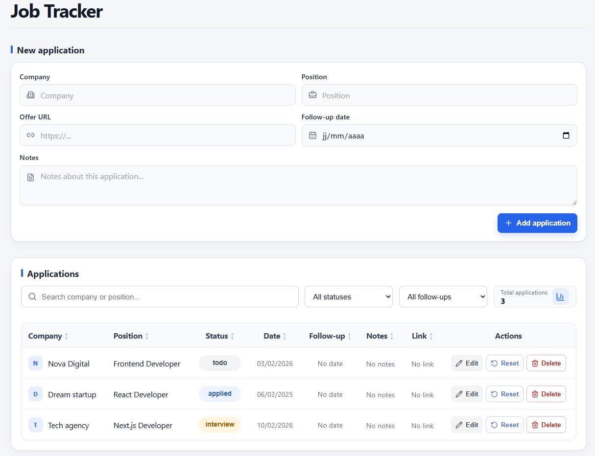

# Job Tracker

A responsive job application tracker built with Next.js, React and TypeScript.

[View live demo](https://m-a-job-tracker.vercel.app/)



---

## About the Project

Job Tracker is a responsive application for managing and following job applications directly in the browser.

Applications can be added, edited, searched, filtered and sorted, with status tracking, notes and follow-up dates. Data is saved locally with `localStorage`.

---

## Features

- Add, edit and delete job applications
- Track application status from `todo` to `rejected`
- Add offer links, notes and follow-up dates
- Track upcoming, today and overdue follow-ups
- Search and filter applications by status and follow-up
- Sort applications with TanStack Table
- Persist data with `localStorage`
- Responsive desktop table and mobile cards

---

## Built With


---

## Installation

```bash
git clone https://github.com/m-amroune/job-tracker.git
cd job-tracker
npm install
npm run dev  